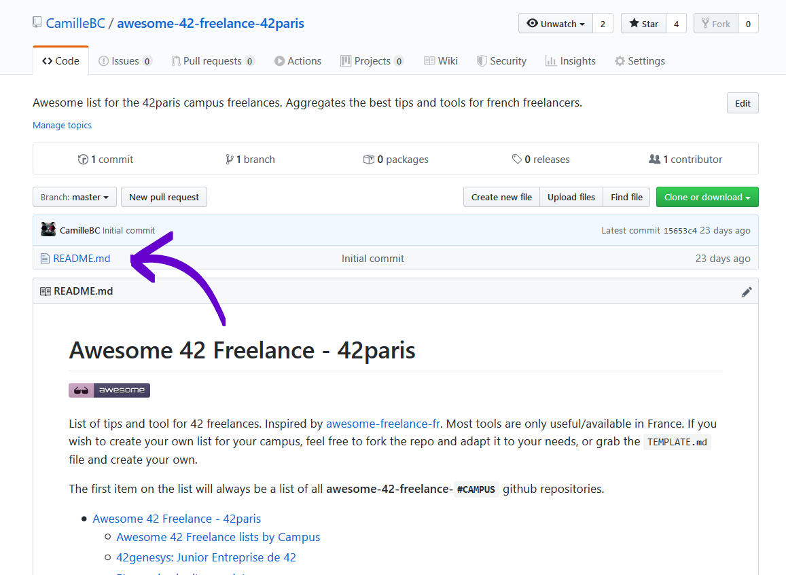
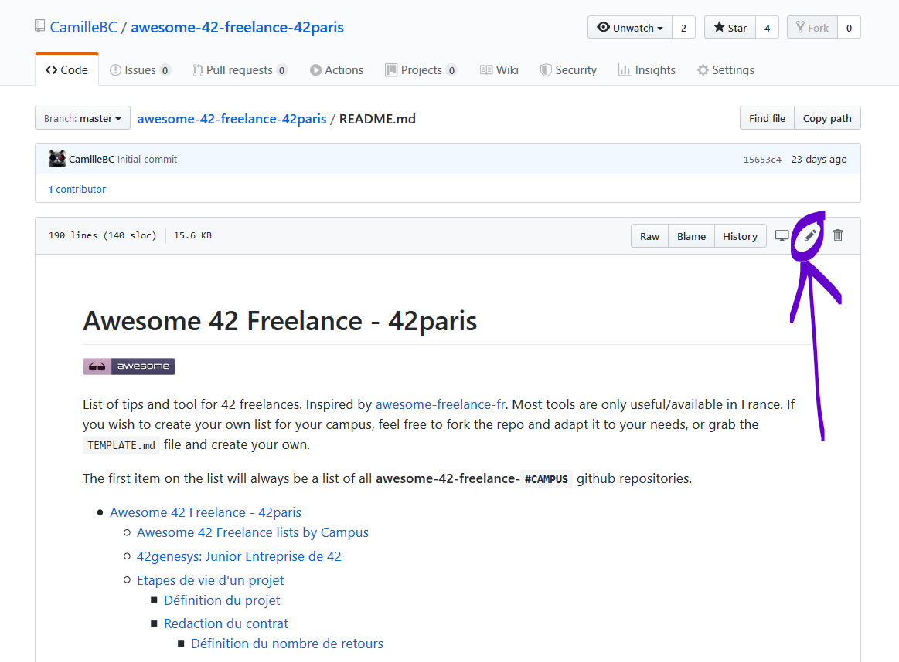
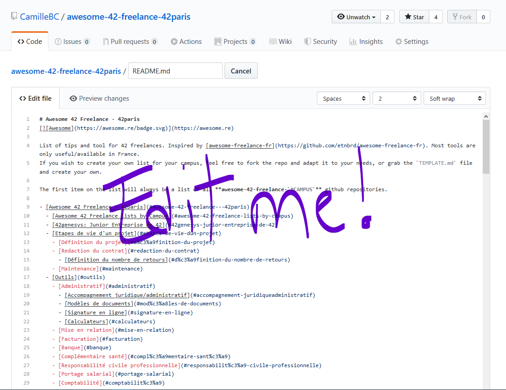

# Contribution Guidelines

## Creating your own awesome freelance list

To create your own list, you can copy start from the [template](TEMPLATE.md) and fill it as you need.
You can alter the presentation if you like, but try to do that only if you **really** need it.

### Campus list

The first item on the list will always be a list of all **awesome-42-freelance-`#CAMPUS`** github repositories.
Format:

```markdown
## Awesome 42 Freelance lists by Campus

- [42paris](https://github.com/CamilleBC/awesome-42-freelance-42paris)
```

## Adding something to an awesome freelance list

If you have something awesome to contribute to an awesome list, this is how you do it.

You'll need a [GitHub account](https://github.com/join)!

1. Access the awesome list's GitHub page. For example: [https://github.com/CamilleBC/awesome-42-freelance-42paris](https://github.com/CamilleBC/awesome-42-freelance-42paris)
2. Click on the `README.md` file: 
3. Now click on the edit icon. 
4. You can start editing the text of the file in the in-browser editor. Make sure you follow guidelines above. You can use [GitHub Flavored Markdown](https://help.github.com/articles/github-flavored-markdown/). 
5. Say why you're proposing the changes, and then click on "Propose file change". 
6. Submit the [pull request](https://help.github.com/articles/using-pull-requests/)!

## Updating your Pull Request

Sometimes, a maintainer of an awesome list will ask you to edit your Pull Request before it is included. This is normally due to spelling errors or because your PR didn't match the awesome-\* list guidelines.

[Here](https://github.com/RichardLitt/knowledge/blob/master/github/amending-a-commit-guide.md) is a write up on how to change a Pull Request, and the different ways you can do that.
